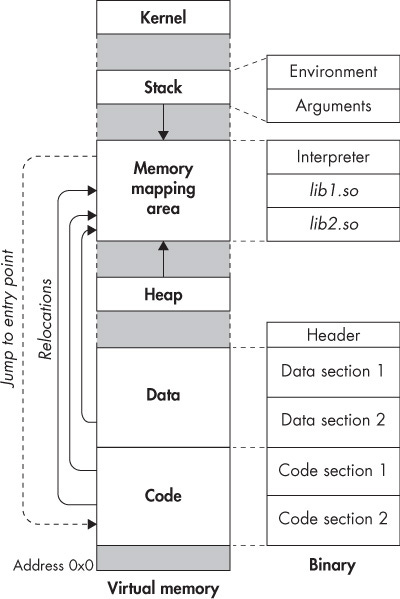

:::layout{justifyContent="center" alignItems="flex-start"}
# <span style="color: #004d7f;">Reverse Engineering Fundamentals</span>

<span style="color: #0076ba;">Master the art of dissecting software to understand how it works — and how it breaks.</span>
:::

***

:::note{title="Course Overview&#xA;"}
This course covers the foundational techniques used by security engineers to analyze compiled binaries, understand malware behavior, and find vulnerabilities in software without access to source code.

**Prerequisites:** Basic understanding of C/C++ and x86 assembly recommended.
:::

::::gridContainer{style="margin: 4px;"}
:::grid{textAlign="center"}


CMI5 course is range enabled with RangeOS
:::
::::

***

:::layout{justifyContent="center" alignItems="flex-start"}
## <span style="color: #004d7f;">The Reverse Engineer's Toolkit</span>
:::

:::::tabs{color="transparent"}
::::tabContent{title="Static Analysis"}
### Analyzing Without Running

Static analysis means examining a binary **without executing it**. This is your first line of investigation.

**Core Tools:**

:::tip{title="Pro Tip"}
Always run `strings` first. Hardcoded passwords, URLs, and error messages are often left in plain sight.
:::
::::

::::tabContent{title="Dynamic Analysis"}
### Analyzing at Runtime

Dynamic analysis involves **executing the binary** in a controlled environment and observing its behavior.

**Core Tools:**

:::warning{title="Safety First"}
Always run unknown binaries inside an **isolated VM or sandbox**. Never execute suspicious files on your host machine.
:::
::::
:::::

***

:::layout{justifyContent="center" alignItems="flex-start"}
## <span style="color: #004d7f;">Understanding x86 Assembly</span>
:::

RIP (Instruction Pointer) holds the address of the next instruction to execute — controlling RIP means:   :fx[   controlling the program]{type="circle" color="#ee230c"}.

::::steps{color="transparent"}
:::stepContent{title="What is Assembly Language?"}
Assembly language is a **low-level programming language** that closely corresponds to a computer's **machine code instructions**. Each instruction typically maps directly to a **CPU instruction**.


:::

:::stepContent{title="Register Examples"}
A register is a **small, fast storage location inside the CPU** used to hold data temporarily while instructions execute.

Examples in x86:

* `EAX`
* `EBX`
* `ECX`
* `EDX`
:::

:::stepContent{title="The MOV Instruction"}
`MOV` copies data from one location to another.

Example:

`MOV EAX, 5`

This stores the value `5` in register `EAX`.
:::
::::

***

:::layout{justifyContent="center" alignItems="flex-start"}
## <span style="color: #004d7f;">Finding Vulnerabilities</span>


:::

:::::accordion{style="margin: 8px 0;"}
:::accordionContent{title="Buffer Overflows"}
### Smashing the Stack

A buffer overflow occurs when a program writes more data into a buffer than it was allocated, overwriting adjacent memory.

**Vulnerable C pattern:**

```c
void login(char *input) {
    char buffer[64];
    strcpy(buffer, input);  // No bounds check!
    // ...
}
```

**What to look for in assembly:**

* Fixed-size stack buffers (`sub rsp, 0x40`)
* Calls to `strcpy`, `gets`, `scanf("%s")`, `sprintf`
* Missing length checks before memory writes

**Exploitation steps:**

1. Find the offset to the return address (use `cyclic` from pwntools)
2. Confirm control of `RIP`
3. Redirect to shellcode or a ROP chain
:::

::::accordionContent{title="Format String Bugs"}
### Reading and Writing Arbitrary Memory

When user input is passed directly as the format string to `printf`, an attacker controls the output format.

```c
// Vulnerable
printf(user_input);

// Safe
printf("%s", user_input);
```

**Exploitation:**

* `%x` — leak stack values as hex
* `%s` — read memory at a stack address
* `%n` — **write** the number of bytes printed so far to an address

```bash
# Leak 8 stack values
./vuln "%x.%x.%x.%x.%x.%x.%x.%x"
```

:::warning{title="Write Primitive"}
`%n` gives an attacker an **arbitrary write** primitive — one of the most powerful exploitation techniques available.
:::
::::

:::accordionContent{title="Use-After-Free"}
### Exploiting the Heap

A use-after-free (UAF) occurs when a program continues to use a pointer after the memory it points to has been freed.

```c
char *buf = malloc(64);
free(buf);
// ... later ...
buf[0] = 'A';  // UAF! buf points to freed memory
```

**Why it's dangerous:**

1. Freed chunk is returned to the allocator
2. Attacker triggers another allocation of the same size
3. Attacker-controlled data fills the old chunk
4. Original pointer now reads/executes attacker data

**Detection in Ghidra:**

* Look for `free()` calls followed by continued use of the same pointer
* Trace pointer lifetimes through all code paths
:::

::::accordionContent{title="Hardcoded Secrets"}
### The Lowest-Hanging Fruit

Before reaching for a debugger, always check for hardcoded credentials and keys:

```bash
# Extract printable strings
strings ./binary | grep -iE "pass|key|secret|token|flag|admin"

# Search for URL patterns
strings ./binary | grep -E "https?://"

# Look for base64 blobs
strings ./binary | grep -E "^[A-Za-z0-9+/]{20,}={0,2}$"

# Find embedded crypto constants (AES S-Box, etc.)
binwalk -A ./binary
```

:::success{title="Quick Win"}
Over 40% of beginner CTF challenges are solved with `strings` alone. Always start simple.
:::
::::
:::::

:::layout{justifyContent="center" alignItems="flex-start"}
## <span style="color: #004d7f;">Linux Vs. Windows</span>
:::

::::gridContainer{style="margin: 4px;"}
:::grid{textAlign="center"}
Linux


:::

:::grid{textAlign="center"}
Windows


:::
::::

:::layout{justifyContent="center" alignItems="flex-start"}
### <span style="color: #004d7f;">Summary of Differences</span>
:::

<table class="rc5-table"><thead><tr><th style="background-color: transparent">Category</th><th style="background-color: transparent">Linux</th><th style="background-color: transparent">Windows</th></tr></thead><tbody><tr><td style="background-color: transparent">Typical Binary Format</td><td style="background-color: transparent">ELF (Executable and Linkable Format)</td><td style="background-color: transparent">PE (Portable Executable)</td></tr><tr><td style="background-color: transparent">Common Disassemblers</td><td style="background-color: transparent">Ghidra, Radare2, objdump, Hopper</td><td style="background-color: transparent">IDA Pro, Ghidra, x64dbg, Binary Ninja</td></tr><tr><td style="background-color: transparent">Debuggers</td><td style="background-color: transparent">gdb, pwndbg, gef, lldb</td><td style="background-color: transparent">WinDbg, x64dbg, OllyDbg</td></tr><tr><td style="background-color: transparent">System Libraries</td><td style="background-color: transparent">glibc, musl</td><td style="background-color: transparent">Windows API (kernel32.dll, user32.dll, ntdll.dll)</td></tr><tr><td style="background-color: transparent">Symbol Inspection</td><td style="background-color: transparent">, , </td><td style="background-color: transparent">Dependency Walker, dumpbin</td></tr><tr><td style="background-color: transparent">Process Inspection</td><td style="background-color: transparent">, , </td><td style="background-color: transparent">Process Monitor, Process Explorer</td></tr><tr><td style="background-color: transparent">Kernel Interaction</td><td style="background-color: transparent"> filesystem, ptrace</td><td style="background-color: transparent">Windows kernel debugging, KD</td></tr><tr><td style="background-color: transparent">Dynamic Analysis</td><td style="background-color: transparent">gdb + ptrace, ltrace, strace</td><td style="background-color: transparent">WinDbg, x64dbg, API monitors</td></tr><tr><td style="background-color: transparent">Malware Targeting</td><td style="background-color: transparent">Less common but growing (servers, IoT)</td><td style="background-color: transparent">Very common (desktop malware)</td></tr><tr><td style="background-color: transparent">System Call Analysis</td><td style="background-color: transparent">Visible via </td><td style="background-color: transparent">Requires kernel debugging or tracing tools</td></tr><tr><td style="background-color: transparent">Obfuscation Techniques</td><td style="background-color: transparent">Packers, stripped symbols</td><td style="background-color: transparent">Packers, obfuscation, anti-debugging</td></tr><tr><td style="background-color: transparent">Anti-Debug Techniques</td><td style="background-color: transparent">ptrace detection</td><td style="background-color: transparent">IsDebuggerPresent, NtQueryInformationProcess</td></tr><tr><td style="background-color: transparent">Binary Patching</td><td style="background-color: transparent">Hex editors, radare2, Ghidra</td><td style="background-color: transparent">x64dbg patching, IDA patching</td></tr><tr><td style="background-color: transparent">Memory Analysis</td><td style="background-color: transparent">, gdb</td><td style="background-color: transparent">WinDbg, volatility</td></tr><tr><td style="background-color: transparent">Open Source Tools</td><td style="background-color: transparent">Very strong ecosystem</td><td style="background-color: transparent">More commercial tools</td></tr><tr><td style="background-color: transparent">Typical Workflow</td><td style="background-color: transparent">Analyze ELF → disassemble → debug with gdb</td><td style="background-color: transparent">Analyze PE → disassemble → debug with WinDbg/x64dbg</td></tr></tbody></table>

***

:::layout{justifyContent="center" alignItems="flex-start"}
## <span style="color: #004d7f;">Anti-Debugging Techniques</span>
:::

Malware and commercial software routinely detect when they're being debugged and alter their behavior — or crash entirely. Recognizing these tricks is essential.

### Windows Anti-Debug Tricks

**IsDebuggerPresent**

```c
if (IsDebuggerPresent()) {
    ExitProcess(0);
}
```

Bypass: Patch the return value to `0` in memory, or use the ScyllaHide plugin in x64dbg.

**Timing Checks**

```c
DWORD start = GetTickCount();
// ... do something ...
if (GetTickCount() - start > 1000) {
    ExitProcess(0);
}
```

Bypass: Patch the conditional jump, or use the "skip" feature in x64dbg.

**NtQueryInformationProcess**

```c
DWORD isDebugged = 0;
NtQueryInformationProcess(GetCurrentProcess(),
    ProcessDebugPort, &isDebugged, sizeof(DWORD), NULL);
```

Bypass: Hook the NT function to always return `0`.

***

### Linux Anti-Debug Tricks

**ptrace detection**

```c
if (ptrace(PTRACE_TRACEME, 0, NULL, NULL) == -1) {
    exit(1);
}
```

Bypass: Use `LD_PRELOAD` to hook `ptrace` and always return `0`.

**`/proc/self/status` check**

```bash
cat /proc/self/status | grep TracerPid
# TracerPid: 1234  ← nonzero means we're being debugged
```

Bypass: Use gdb with `set follow-fork-mode child` or patch the check in memory.

**Self-modifying code**
Some binaries decrypt themselves at runtime and re-encrypt after execution, making static analysis useless.
Bypass: Dump process memory using gdb's `dump memory` command after decryption completes.

***

### Universal Bypass Strategies

* **Patch the check** — Find the anti-debug conditional in the disassembler and NOP out the jump. The check runs but never acts on the result.
* **Hook the API** — Use Frida or LD\_PRELOAD to intercept the function and return a safe value.
* **ScyllaHide (Windows)** — A plugin for x64dbg and IDA that automatically bypasses over 30 common anti-debug techniques.
* **Snapshot and restore** — Run in a VM, take a memory snapshot just after unpacking, then analyze the dumped memory statically.

***

:::layout{justifyContent="center" alignItems="flex-start"}
## <span style="color: #004d7f;">Malware Analysis Workflow</span>
:::

> **Never skip the safe environment step.** One wrong click on an unknown binary can compromise your entire machine.

### Step 1 — Triage

Before touching any tool, answer these questions:

<table class="rc5-table"><thead><tr><th style="background-color: transparent">Question</th><th style="background-color: transparent">Command</th></tr></thead><tbody><tr><td style="background-color: transparent">What OS is this targeting?</td><td style="background-color: transparent"><code>file malware.bin</code></td></tr><tr><td style="background-color: transparent">Is it packed?</td><td style="background-color: transparent"><code>strings malware.bin | wc -l</code> (low count = likely packed)</td></tr><tr><td style="background-color: transparent">What architecture?</td><td style="background-color: transparent"><code>file malware.bin</code> or <code>binwalk malware.bin</code></td></tr><tr><td style="background-color: transparent">Any known signatures?</td><td style="background-color: transparent">Upload hash to VirusTotal</td></tr><tr><td style="background-color: transparent">Embedded files?</td><td style="background-color: transparent"><code>binwalk -e malware.bin</code></td></tr></tbody></table>

Always compute the SHA256 hash first: `sha256sum malware.bin`

***

### Step 2 — Static Analysis

**Extract strings**

```bash
strings -a malware.bin | tee strings.txt
grep -iE "http|ftp|cmd|powershell|registry" strings.txt
```

**Identify imports (Windows PE)**

```bash
objdump -p malware.exe | grep -A 100 "DLL Name"
```

Key imports to watch for:

<table class="rc5-table"><thead><tr><th style="background-color: transparent">Import</th><th style="background-color: transparent">Suggests</th></tr></thead><tbody><tr><td style="background-color: transparent"><code>CreateRemoteThread</code></td><td style="background-color: transparent">Process injection</td></tr><tr><td style="background-color: transparent"><code>VirtualAllocEx</code></td><td style="background-color: transparent">Shellcode injection</td></tr><tr><td style="background-color: transparent"><code>RegSetValueEx</code></td><td style="background-color: transparent">Persistence via registry</td></tr><tr><td style="background-color: transparent"><code>InternetOpenUrl</code></td><td style="background-color: transparent">C2 communication</td></tr><tr><td style="background-color: transparent"><code>CryptEncrypt</code></td><td style="background-color: transparent">Ransomware behavior</td></tr></tbody></table>

***

### Step 3 — Dynamic Analysis

Run in an **isolated VM with no network access** (use INetSim to fake internet services).

```bash
# Linux
strace -o strace.log ./malware
ltrace -o ltrace.log ./malware

# Watch file activity in real time
inotifywait -m -r /tmp /home &
./malware
```

**Windows monitoring stack:**

* **Process Monitor** — file, registry, network, process activity
* **Wireshark** — capture all network traffic
* **Regshot** — snapshot registry before/after execution
* **API Monitor** — log every Windows API call

> Take a VM snapshot **before** executing. If the malware corrupts the environment, you can restore in seconds.


::::gridContainer{style="margin: 4px;"}
:::grid

:::

:::grid
### Wireshark

**Wireshark** is a powerful open-source network protocol analyzer used to capture and inspect network traffic in real time. It allows cybersecurity professionals, network engineers, and researchers to examine individual packets traveling across a network, helping them *troubleshoot connectivity issues, analyze protocols, and detect potential security threats*. By breaking down packets into detailed protocol fields, Wireshark provides deep visibility into how data moves through a network.
:::
::::


***

### Step 4 — Document and Report

A good malware report covers:

1. **Executive Summary** — what it does in plain English
2. **Indicators of Compromise (IOCs)**
   * File hashes (MD5, SHA256)
   * File paths created
   * Registry keys modified
   * Network domains/IPs contacted
3. **Technical Analysis** — step-by-step behavior
4. **MITRE ATT\&CK Mapping** — map behaviors to the framework
5. **Recommendations** — detection rules (YARA, Sigma)

**Example YARA rule:**

```yara
rule SuspiciousMalware {
    meta:
        description = "Detects hardcoded C2 domain"
    strings:
        $domain = "evil-c2.example.com"
        $api1   = "CreateRemoteThread"
        $api2   = "VirtualAllocEx"
    condition:
        $domain and any of ($api*)
}
```

***

:::layout{justifyContent="center" alignItems="flex-start"}
## <span style="color: #004d7f;">CTF Strategy Guide</span>
:::

### Start Here — Every Time

1. `file ./binary`
2. `strings ./binary | less`
3. `checksec ./binary`
4. `ltrace ./binary`
5. Load into Ghidra

Work fast and wide before going deep.

***

### Reading checksec Output

```
Arch:     amd64-64-little
RELRO:    Full RELRO
Stack:    Canary found
NX:       NX enabled
PIE:      PIE enabled
```

All protections on means harder exploitation. No canary and no NX means a classic buffer overflow target.

***

### Common Rabbit Holes to Avoid

* Spending hours on crypto when `strings` already had the key
* Debugging the wrong binary (check for wrapper scripts)
* Ignoring environment variables that change behavior
* Missing that the binary forks — attach to the child process

***

### Quick Wins Checklist

* [ ] Hardcoded strings or base64
* [ ] Hardcoded comparison (`cmp eax, 0x1337`)
* [ ] Predictable random seed (`srand(time(0))`)
* [ ] strcmp vs strncmp off-by-one
* [ ] Format string passed directly to printf