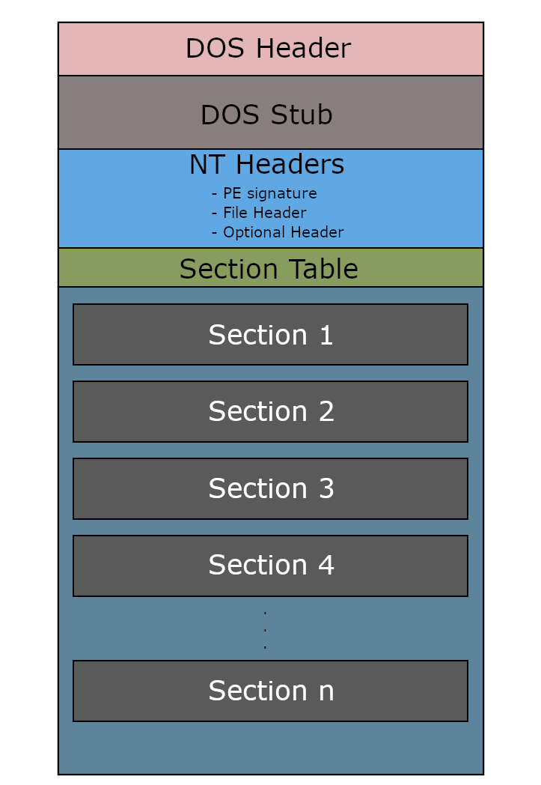

:::layout{justifyContent="center" alignItems="flex-start"}
# <span style="color: #004d7f;">Reverse Engineering Fundamentals</span>

<span style="color: #0076ba;">Master the art of dissecting software to understand how it works — and how it breaks.</span>
:::

***

:::note{title="Course Overview&#xA;"}
This course covers the foundational techniques used by security engineers to analyze compiled binaries, understand malware behavior, and find vulnerabilities in software without access to source code.

**Prerequisites:** Basic understanding of C/C++ and x86 assembly recommended.
:::

::::gridContainer{style="margin: 4px;"}
:::grid{textAlign="center"}


CMI5 course is range enabled with RangeOS
:::
::::

***

:::layout{justifyContent="center" alignItems="flex-start"}
## <span style="color: #004d7f;">The Reverse Engineer's Toolkit</span>
:::

:::::tabs{color="transparent"}
::::tabContent{title="Static Analysis"}
### Analyzing Without Running

Static analysis means examining a binary **without executing it**. This is your first line of investigation.

**Core Tools:**

:::tip{title="Pro Tip"}
Always run `strings` first. Hardcoded passwords, URLs, and error messages are often left in plain sight.
:::
::::

::::tabContent{title="Dynamic Analysis"}
### Analyzing at Runtime

Dynamic analysis involves **executing the binary** in a controlled environment and observing its behavior.

**Core Tools:**

:::warning{title="Safety First"}
Always run unknown binaries inside an **isolated VM or sandbox**. Never execute suspicious files on your host machine.
:::
::::
:::::

***

:::layout{justifyContent="center" alignItems="flex-start"}
## <span style="color: #004d7f;">Understanding x86 Assembly</span>
:::

RIP (Instruction Pointer) holds the address of the next instruction to execute — controlling RIP means:   :fx[   controlling the program]{type="circle" color="#ee230c"}.

::::steps{color="transparent"}
:::stepContent{title="What is Assembly Language?"}
Assembly language is a **low-level programming language** that closely corresponds to a computer's **machine code instructions**. Each instruction typically maps directly to a **CPU instruction**.
:::

:::stepContent{title="Register Examples"}
A register is a **small, fast storage location inside the CPU** used to hold data temporarily while instructions execute.

Examples in x86:

* `EAX`
* `EBX`
* `ECX`
* `EDX`
:::

:::stepContent{title="The MOV Instruction"}
`MOV` copies data from one location to another.

Example:

`MOV EAX, 5`

This stores the value `5` in register `EAX`.
:::
::::

***

:::layout{justifyContent="center" alignItems="flex-start"}
## <span style="color: #004d7f;">Finding Vulnerabilities</span>


:::

:::::accordion{style="margin: 8px 0;"}
:::accordionContent{title="Buffer Overflows"}
### Smashing the Stack

A buffer overflow occurs when a program writes more data into a buffer than it was allocated, overwriting adjacent memory.

**Vulnerable C pattern:**

```c
void login(char *input) {
    char buffer[64];
    strcpy(buffer, input);  // No bounds check!
    // ...
}
```

**What to look for in assembly:**

* Fixed-size stack buffers (`sub rsp, 0x40`)
* Calls to `strcpy`, `gets`, `scanf("%s")`, `sprintf`
* Missing length checks before memory writes

**Exploitation steps:**

1. Find the offset to the return address (use `cyclic` from pwntools)
2. Confirm control of `RIP`
3. Redirect to shellcode or a ROP chain
:::

::::accordionContent{title="Format String Bugs"}
### Reading and Writing Arbitrary Memory

When user input is passed directly as the format string to `printf`, an attacker controls the output format.

```c
// Vulnerable
printf(user_input);

// Safe
printf("%s", user_input);
```

**Exploitation:**

* `%x` — leak stack values as hex
* `%s` — read memory at a stack address
* `%n` — **write** the number of bytes printed so far to an address

```bash
# Leak 8 stack values
./vuln "%x.%x.%x.%x.%x.%x.%x.%x"
```

:::warning{title="Write Primitive"}
`%n` gives an attacker an **arbitrary write** primitive — one of the most powerful exploitation techniques available.
:::
::::

:::accordionContent{title="Use-After-Free"}
### Exploiting the Heap

A use-after-free (UAF) occurs when a program continues to use a pointer after the memory it points to has been freed.

```c
char *buf = malloc(64);
free(buf);
// ... later ...
buf[0] = 'A';  // UAF! buf points to freed memory
```

**Why it's dangerous:**

1. Freed chunk is returned to the allocator
2. Attacker triggers another allocation of the same size
3. Attacker-controlled data fills the old chunk
4. Original pointer now reads/executes attacker data

**Detection in Ghidra:**

* Look for `free()` calls followed by continued use of the same pointer
* Trace pointer lifetimes through all code paths
:::

::::accordionContent{title="Hardcoded Secrets"}
### The Lowest-Hanging Fruit

Before reaching for a debugger, always check for hardcoded credentials and keys:

```bash
# Extract printable strings
strings ./binary | grep -iE "pass|key|secret|token|flag|admin"

# Search for URL patterns
strings ./binary | grep -E "https?://"

# Look for base64 blobs
strings ./binary | grep -E "^[A-Za-z0-9+/]{20,}={0,2}$"

# Find embedded crypto constants (AES S-Box, etc.)
binwalk -A ./binary
```

:::success{title="Quick Win"}
Over 40% of beginner CTF challenges are solved with `strings` alone. Always start simple.
:::
::::
:::::

:::layout{justifyContent="center" alignItems="flex-start"}
## <span style="color: #004d7f;">Linux Vs. Windows</span>
:::

::::gridContainer{style="margin: 4px;"}
:::grid{textAlign="center"}
Linux


:::

:::grid{textAlign="center"}
Windows


:::
::::

:::layout{justifyContent="center" alignItems="flex-start"}
### <span style="color: #004d7f;">Differences of Linux and Windows</span>
:::

# Reverse Engineering: Linux vs Windows

<table class="rc5-table"><thead><tr><th style="background-color: transparent">Category</th><th style="background-color: transparent">Linux</th><th style="background-color: transparent">Windows</th></tr></thead><tbody><tr><td style="background-color: transparent">Typical Binary Format</td><td style="background-color: transparent">ELF (Executable and Linkable Format)</td><td style="background-color: transparent">PE (Portable Executable)</td></tr><tr><td style="background-color: transparent">Common Disassemblers</td><td style="background-color: transparent">Ghidra, Radare2, objdump, Hopper</td><td style="background-color: transparent">IDA Pro, Ghidra, x64dbg, Binary Ninja</td></tr><tr><td style="background-color: transparent">Debuggers</td><td style="background-color: transparent">gdb, pwndbg, gef, lldb</td><td style="background-color: transparent">WinDbg, x64dbg, OllyDbg</td></tr><tr><td style="background-color: transparent">System Libraries</td><td style="background-color: transparent">glibc, musl</td><td style="background-color: transparent">Windows API (kernel32.dll, user32.dll, ntdll.dll)</td></tr><tr><td style="background-color: transparent">Symbol Inspection</td><td style="background-color: transparent"><code>nm</code>, <code>objdump</code>, <code>readelf</code></td><td style="background-color: transparent">Dependency Walker, dumpbin</td></tr><tr><td style="background-color: transparent">Process Inspection</td><td style="background-color: transparent"><code>strace</code>, <code>ltrace</code>, <code>ptrace</code></td><td style="background-color: transparent">Process Monitor, Process Explorer</td></tr><tr><td style="background-color: transparent">Kernel Interaction</td><td style="background-color: transparent"><code>/proc</code> filesystem, ptrace</td><td style="background-color: transparent">Windows kernel debugging, KD</td></tr><tr><td style="background-color: transparent">Dynamic Analysis</td><td style="background-color: transparent">gdb + ptrace, ltrace, strace</td><td style="background-color: transparent">WinDbg, x64dbg, API monitors</td></tr><tr><td style="background-color: transparent">Malware Targeting</td><td style="background-color: transparent">Less common but growing (servers, IoT)</td><td style="background-color: transparent">Very common (desktop malware)</td></tr><tr><td style="background-color: transparent">System Call Analysis</td><td style="background-color: transparent">Visible via <code>strace</code></td><td style="background-color: transparent">Requires kernel debugging or tracing tools</td></tr><tr><td style="background-color: transparent">Obfuscation Techniques</td><td style="background-color: transparent">Packers, stripped symbols</td><td style="background-color: transparent">Packers, obfuscation, anti-debugging</td></tr><tr><td style="background-color: transparent">Anti-Debug Techniques</td><td style="background-color: transparent">ptrace detection</td><td style="background-color: transparent">IsDebuggerPresent, NtQueryInformationProcess</td></tr><tr><td style="background-color: transparent">Binary Patching</td><td style="background-color: transparent">Hex editors, radare2, Ghidra</td><td style="background-color: transparent">x64dbg patching, IDA patching</td></tr><tr><td style="background-color: transparent">Memory Analysis</td><td style="background-color: transparent"><code>/proc/[pid]/mem</code>, gdb</td><td style="background-color: transparent">WinDbg, volatility</td></tr><tr><td style="background-color: transparent">Open Source Tools</td><td style="background-color: transparent">Very strong ecosystem</td><td style="background-color: transparent">More commercial tools</td></tr><tr><td style="background-color: transparent">Typical Workflow</td><td style="background-color: transparent">Analyze ELF → disassemble → debug with gdb</td><td style="background-color: transparent">Analyze PE → disassemble → debug with WinDbg/x64dbg</td></tr></tbody></table>